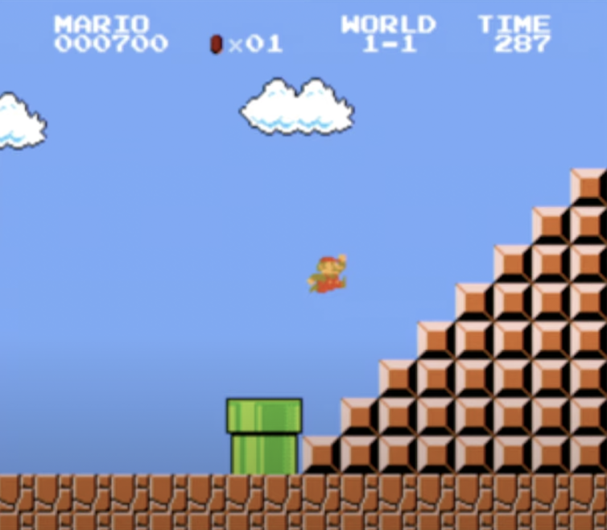
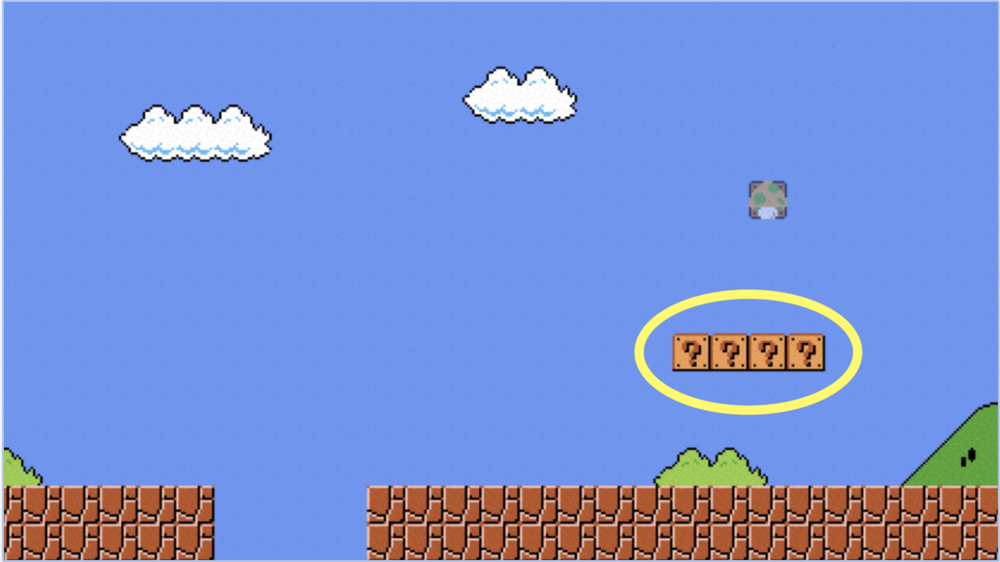
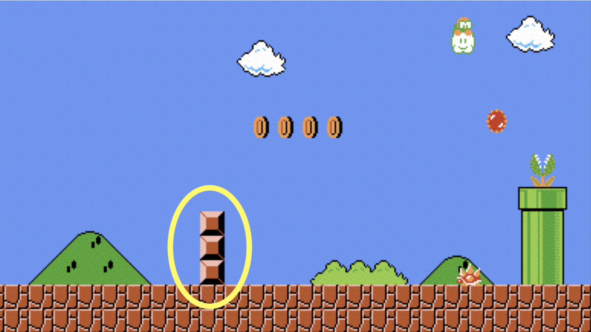
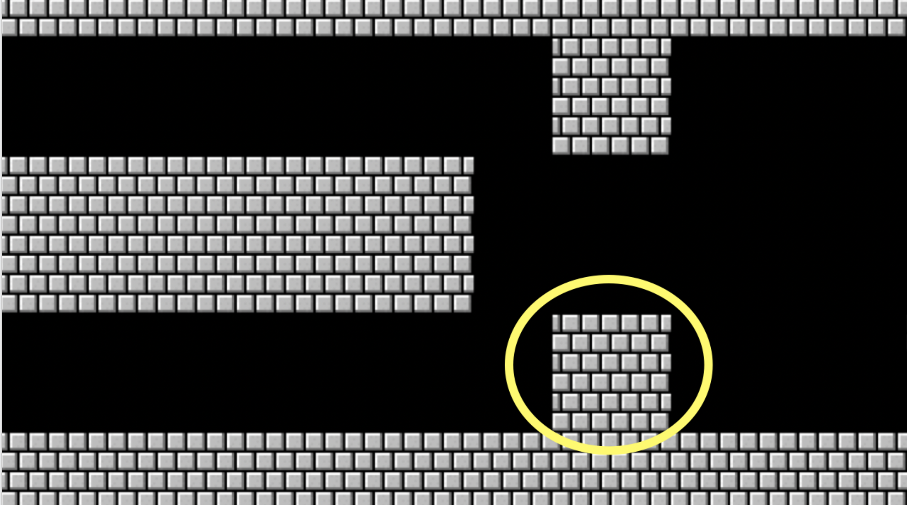

## Break big problems into smaller parts

Lets try and solve a `ASCII Art` problem and try to print the pyramid from Super Mario Bros to the terminal using C dynamically.



As a beginner this problem might initially seem dauting, so lets break it into smaller more manageable parts.

### Horizontal Row

Lets first try and print a horizontal row of question marks to the screen, something similar to:



#### One approach might be

```C
#include <stdio.h>

int main(void)
{
    printf("????\n");
}
```

However there are many problems with this solution:

- It is `hard coded`, meaning the number of question marks are always fixed.
- Therefore, for every number we will have to use a different program.
- What if we needed different number of question marks depending on different types of player?

Thankfully we can easily solve these problems using a for loop.
But first lets figure out a way to get inputfrom the user.

#### Getting Input From User

```C
#include <stdio.h>

int main(void)
{
    // declare a variable to store the number in
    int number;
    do
    {
        // prompt user for input
        printf("Enter an integer: ");

        // scan that input
        scanf("%i", &number);

        // keep doing so until this condition is met
    } while (width < 0 );

    // print the number user provided to the terminal
    printf("You Entered: %i\n", number);
}
```

#### For Loop

Now lets take input from the user and print that number of question marks to the terminal.

```C
#include <stdio.h>

int main(void)
{
    int width;
    do
    {
        printf("Enter an integer: ");
        scanf("%i", &width);
    } while (width < 0 );

    for (int i = 0; i < width; i ++) {
        printf("?");
    }

    printf("\n");
}
```

### Vertical Column

Now that we have succesfully printed a horizontal column to the terminal lets try and print a vertical column as well.



```C
#include <stdio.h>

int main(void)
{
    // take input from the user
    int length;
    do
    {
        printf("Enter an integer: ");
        scanf("%i", &length);
    } while (length < 0 );

    for (int i = 0; i < length; i ++) {
        printf("? \n");
    }

    printf("\n");
}
```

Here we just make a slight modification and print `\n` after each iteration

### Printing 2-D Block



```C
#include <stdio.h>

int main(void)
{
    for (int i = 0; i < 3; i++)
    {
        for (int j = 0; j < 3; j++)
        {
            printf("#");
        }
        printf("\n");
    }
}

```

### Solving the problem

```C
#include <stdio.h>
#include <cs50.h>

int main(void)
{
    //promts user for height
    int n;
    do
    {
        printf("Height: ");
        scanf("%i", &n);
    }
    while (n < 1 || n > 8);

    //build a right inclined pyramid
    for (int i = 0 ; i < n ; i++)
    {
        for (int j = 0; j < n; j++)
        {
            if (i + j < n - 1)
                printf(" ");

            else
                printf("#");
        }
        printf("\n");
    }
}

```

## Credits

CS50x - Week 1 - https://cs50.harvard.edu/x/2021/weeks/1/
